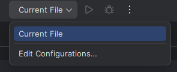
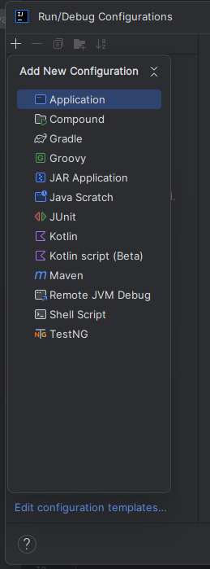
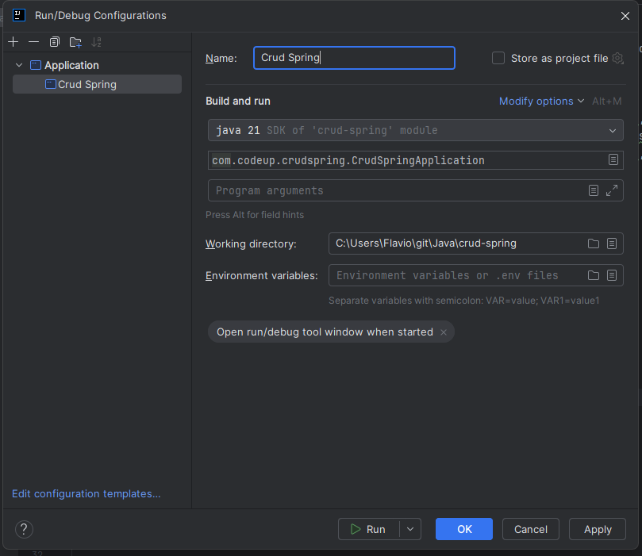
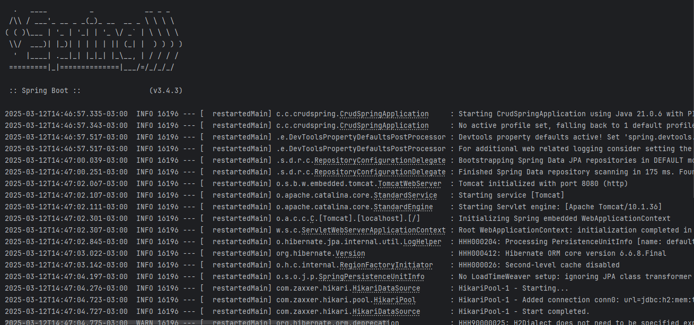

# Cadastro Curso

Esta aplicação foi desenvolvida utilizando Java e Spring Boot para fornecer uma API para o gerenciamento de cursos e aulas. O sistema foi projetado para a criação e organização de cursos e suas respectivas aulas.

Funcionalidades:

- **Criar Cursos**: Permite o cadastro de novos cursos, definindo informações como título, descrição e outros dados relevantes para o curso.
- **Alterar Cursos**: Oferece a possibilidade de editar as informações de um curso ou de suas aulas associadas, garantindo a atualização contínua dos dados.
- **Excluir Cursos**: Permite a remoção de um curso, excluindo-o completamente do sistema, juntamente com suas aulas relacionadas.

## Tecnologias Utilizadas

- Spring Boot 3.5.3
- Java 21 
- JUnit 5

* Nota: O projeto foi originalmente criado com Java 17 e Spring Boot 2.6.3 .*

### Subir o Projeto

Executar o Docker

- Navegue até a pasta `/docker`.
- Execute o seguinte comando para iniciar os containers:

 ```bash
     docker-compose up
```

1. Vá para `Run` > `Edit Configurations`.

   

2. Na janela que se abre, clique em `+` e escolha `Application` na lista de opções.

   

3. Preencha os campos como nome do projeto, defina a versão do Java como 21.

   

4. Clique em `Apply` e depois em `Run`.

   


## Licença

Este projeto está licenciado sob a [Licença MIT](LICENSE).