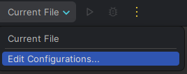
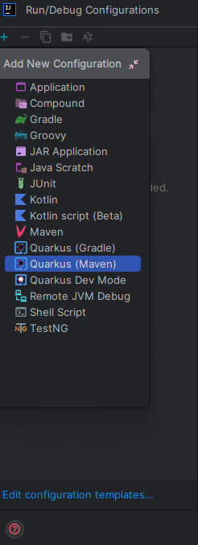
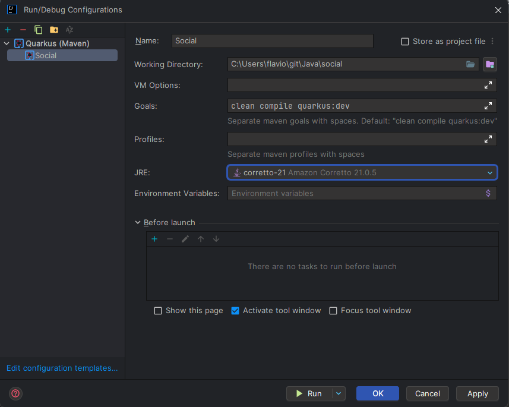
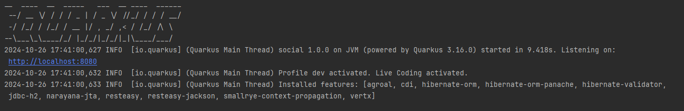

# Mine Rede Social

Esta é uma aplicação simples que simula alguns comportamentos de uma rede social, desenvolvida com Quarkus.

## Tecnologias Usadas

- **Java**: 21
- **Quarkus**: 3.17.5

* Nota: O projeto foi originalmente criado com Java 11 e Quarkus 2.9.1.Final.*

## Configuração Local

### Instalar o Plugin Quarkus no IntelliJ IDEA

1. No menu superior, clique em File > Settings (ou pressione Ctrl + Alt + S).
2. No painel à esquerda, clique em Plugins.
3. Na aba Marketplace, digite "Quarkus" na barra de busca.
4. Quando encontrar o plugin Quarkus, clique em Install.
5. Após a instalação, clique em Restart IDE para aplicar as mudanças.

### Subir o Projeto

1. Vá para `Run` > `Edit Configurations`.

   

2. Na janela que se abre, clique em `+` e escolha `Quarkus` na lista de opções.

   

3. Preencha os campos como nome do projeto, `Working Directory` e defina a versão do Java como 21.

   

4. Clique em `Apply` e depois em `Run`.

   

5. Executar o Docker

   - Navegue até a pasta `/docker`.
   - Execute o seguinte comando para iniciar os containers:

 ```bash
     docker-compose up
```

## Licença

Este projeto está licenciado sob a [Licença MIT](LICENSE).